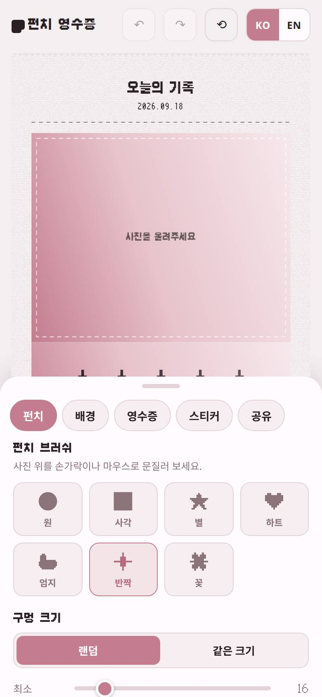
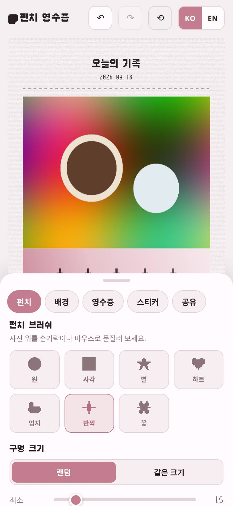
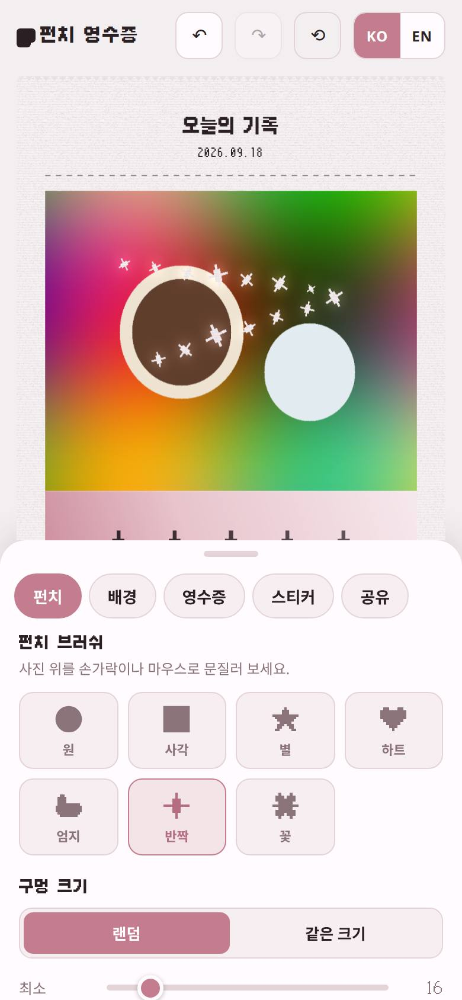
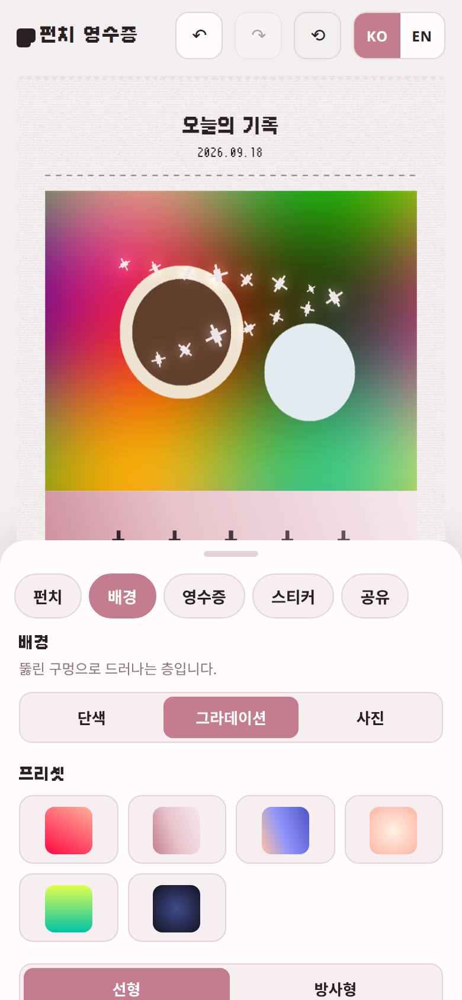
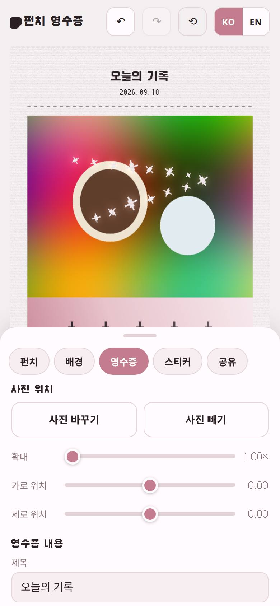
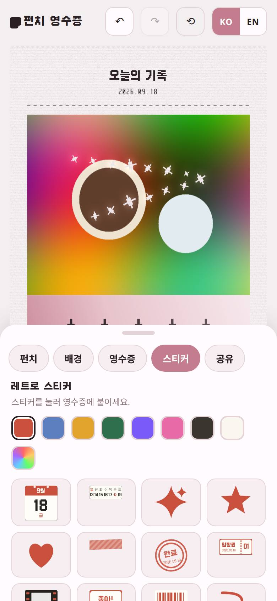
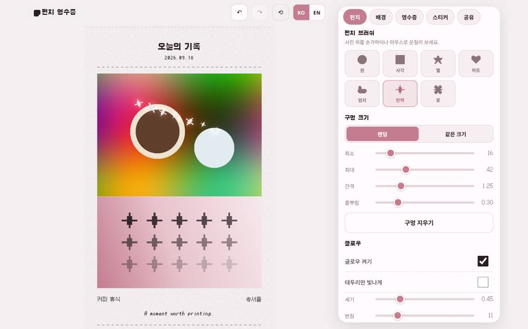

# Punch Receipt · 펀치 영수증

사진에 구멍을 뚫어 영수증처럼 저장·공유하는 웹앱입니다.

---

## 시나리오

홈 / 사진

<table>
<tr>
<td width="50%" valign="top">

<p>앱을 열면 펀치 탭이 나옵니다.</p>
</td>
<td width="50%" valign="top">

<p>점선 안을 눌러 사진을 올립니다.</p>
</td>
</tr>
</table>

펀치 / 배경

<table>
<tr>
<td width="50%" valign="top">

<p>문질러 구멍을 뚫습니다.</p>
</td>
<td width="50%" valign="top">

<p>배경을 바꾸면 구멍으로 비치는 색이 바뀝니다.</p>
</td>
</tr>
</table>

영수증 / 스티커

<table>
<tr>
<td width="50%" valign="top">

<p>제목·날짜·메모를 고칩니다.</p>
</td>
<td width="50%" valign="top">

<p>스티커를 붙이고 공유합니다.</p>
</td>
</tr>
</table>

데스크톱

<p>

</p>

---

## 실행

```bash
npm install
npm run dev
```
